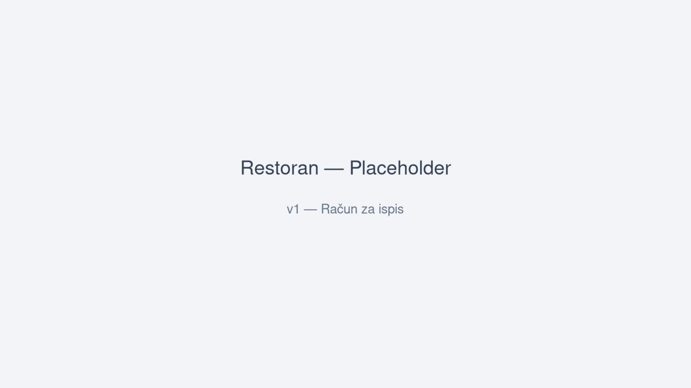

# Restoran - Web aplikacija (v1 i v2)

Ovaj repozitorij sadrži dvije verzije aplikacije za školski projekt:

- v1 (frontend only) — HTML/CSS/JS, učenici mogu raditi lokalno i spremiti narudžbe/rezervacije kao JSON download.
  - Fajlovi: `public/v1/index.html` i `public/v1/script_v1.js`
  - Otvorite `public/v1/index.html` direktno u pregledniku ili koristite mali static server.

- v2 (full stack) — Node.js + Express + SQLite (API + server-side pohrana)
  - Pokretanje:
    1. instalirajte Node.js
    2. u root direktoriju: `npm install`
    3. `npm start`
    4. otvorite `http://localhost:3000`

Sadržaj repozitorija:
- `package.json`
- `server.js`
- `db.js`
- `.gitignore`
- `public/` (sadrži v2 frontend i v1 folder za lokalnu verziju)

Aplikacija:
- Meni s 10 jela
- 10 stolova na terasi ("terasa") i 10 stolova u restoranu ("restoran")
- Narudžbe s načinom plaćanja (gotovina/kartica)
- Posebna forma za rezervacije (odvojeno od narudžbe)

## Sadržaj (TOC)

- [Brzi start](#brzi-start)
  - [v1 (frontend only)](#v1-frontend-only)
  - [v2 (full stack)](#v2-full-stack)
- [Tutorijal: korak-po-korak](#tutorijal-korak-po-korak)
  - [v1: Offline narudžba i račun](#v1-offline-narudžba-i-račun)
  - [v2: Online narudžba s bazom](#v2-online-narudžba-s-bazom)
- [Admin sučelje](#admin-sučelje)
- [Snimke ekrana](#snimke-ekrana)
- [Rješavanje problema (FAQ)](#rješavanje-problema-faq)
- [Gdje staviti slike](#gdje-staviti-slike)
- [Korisne napomene za nastavu](#korisne-napomene-za-nastavu)

---

## Brzi start

### v1 (frontend only)

1. Otvori datoteku: `public/v1/index.html` (dvostruki klik).
2. Sve radi lokalno bez servera i bez baze.
3. Popuni formu, odaberi jela i spremi narudžbu kao JSON ili generiraj račun za ispis.

Tip: Ako želiš pokrenuti lokalni statički server:
- Python 3: `python -m http.server 8080` pa otvori `http://localhost:8080/public/v1/`
- Node: `npx serve public/v1`

### v2 (full stack)

Preduvjeti: Node.js 18+ i npm.

1. Instalacija ovisnosti:
   ```
   npm install
   ```
2. Pokretanje servera:
   ```
   npm start
   ```
3. Otvori u pregledniku:
   ```
   http://localhost:3000
   ```
4. Testiraj narudžbu i rezervaciju. Podaci se spremaju u SQLite bazu (lokalni fajl).

---

## Tutorijal: korak-po-korak

### v1: Offline narudžba i račun

Cilj: Izraditi narudžbu, spremiti JSON i generirati račun za ispis – sve bez servera.

1) Otvaranje aplikacije
- Otvori `public/v1/index.html`.
- Trebao bi se prikazati meni i forme za narudžbu/ispis računa.
- Očekivano: Na vrhu naslov “Restoran Sirena — Verzija 1 (lokalno)”.

2) Popunjavanje podataka o kupcu
- Ime i prezime: unesi npr. “Ana Kovač”.
- Telefon: unesi u formatu `+3859...` ili `0912345678`.
- E-mail je opcionalan.

3) Odabir lokacije i stola
- Lokacija: “terasa” ili “restoran”.
- Stol: nakon odabira lokacije, izaberi broj stola iz padajućeg izbornika.

4) Odabir načina plaćanja
- Odaberi “gotovina” ili “kartica”.
- Ako odabereš “kartica”, otvara se blok s podacima o kartici (ne šalje se nigdje; samo demonstracija).

5) Dodavanje artikala
- Za svako jelo odredi količinu (0 = ne naručujem).
- Očekivano: ukupna cijena se računa iz zbroja (količina × cijena).

6) Spremanje narudžbe i ispis računa
- Klik “Spremi narudžbu kao JSON” – preuzet ćeš lokalni `.json` fajl.
- Klik “Generiraj račun za ispis” – popuni podatke o firmi (opcionalno) i ispiši račun iz preglednika.

Checklist:
- [ ] Ime i telefon su ispravni
- [ ] Lokacija i stol odabrani
- [ ] Plaćanje odabrano
- [ ] Barem jedan artikl s količinom > 0
- [ ] JSON preuzet i/ili račun ispisan

### v2: Online narudžba s bazom

Cilj: Pokrenuti server, poslati narudžbu/rezervaciju i provjeriti u admin sučelju.

1) Pokretanje servera
- U root folderu: `npm install` pa `npm start`.
- Otvori `http://localhost:3000`.

2) Pregled menija i stolova
- Meni i stolovi se dohvaćaju s API-ja:
  - `GET /api/menu`
  - `GET /api/tables`
- Očekivano: lista jela i popunjeni izbor stolova po lokaciji.

3) Slanje narudžbe
- Popuni ime, telefon, (opcionalno email), lokaciju, stol, način plaćanja.
- Odaberi količine artikala (količina > 0).
- Klik “Pošalji narudžbu”.
- Očekivano: poruka o uspjehu i generirani `orderId`.

4) Slanje rezervacije
- Prebaci na formu za rezervacije (ako je odvojena).
- Popuni ime, telefon, lokaciju, stol, datum i vrijeme, (opcionalno broj osoba).
- Klik “Pošalji rezervaciju”.
- Očekivano: poruka o uspjehu i `reservationId`.

5) Pregled i brisanje u adminu
- Otvori: `http://localhost:3000/admin.html`.
- Vidi liste:
  - Narudžbe: `GET /api/orders` (svaka ima “Obriši” → `DELETE /api/orders/:id`)
  - Rezervacije: `GET /api/reservations` (svaka ima “Obriši” → `DELETE /api/reservations/:id`)
- Očekivano: Brisanje uklanja zapise iz baze (i stavke narudžbe).

Checklist:
- [ ] Server pokrenut bez greške
- [ ] Meni i stolovi se učitavaju
- [ ] Narudžba poslana i vraćen `orderId`
- [ ] Rezervacija poslana i vraćen `reservationId`
- [ ] Admin prikazuje stavke i omogućuje brisanje

---

## Admin sučelje

Jednostavno admin sučelje nalazi se u `public/admin.html`.

Kako koristiti:
1. Pokreni server (v2):
   - `npm install`
   - `npm start`
   - Otvori u pregledniku: `http://localhost:3000/admin.html`

2. Stranica prikazuje:
   - Narudžbe (`GET /api/orders`) — klikom na “Obriši” brišeš narudžbu i pripadajuće stavke (`DELETE /api/orders/:id`).
   - Rezervacije (`GET /api/reservations`) — klikom na “Obriši” brišeš rezervaciju (`DELETE /api/reservations/:id`).

Sigurnosna napomena:
- Ovo admin sučelje je vrlo jednostavno i nema autentikaciju — koristi ga samo lokalno ili na zaštićenom serveru. Za produkciju dodaj autentikaciju (npr. Basic Auth ili sessions) i ograniči pristup.

### admin_auth.html (v3 - zaštićeno)

Zaštićena verzija admin sučelja s HTTP Basic autentikacijom.

1. Pokreni server s vjerodajnicama (opcionalno):
   ```
   export ADMIN_USER=admin
   export ADMIN_PASS=admin123
   npm start
   ```
2. Otvori: `http://localhost:3000/admin_auth.html`
3. Upiši vjerodajnice (default: admin / admin123)
4. Identična funkcionalnost kao admin.html, ali zaštićena

### admin_v4.html (v4 - napredni)

Napredna verzija s pretraživanjem i filtriranjem.

1. Otvori: `http://localhost:3000/admin_v4.html`
2. Funkcionalnosti:
   - Pretraga po imenu/telefonu/emailu
   - Filteri: lokacija, plaćanje, stol
   - Detalji narudžbe (uključujući karticu)
   - Brisanje narudžbi

---

## Snimke ekrana

Napomena: Slike referencirane ispod očekuju se u `docs/images/`. Pogledaj sekciju “Gdje staviti slike”.

- v1 početna:
  

- v1 popunjena narudžba:
  

- v1 račun za ispis:
  

- v2 početna (server pokrenut):
  

- v2 narudžba poslana:
  

- v2 admin (narudžbe i rezervacije):
  

---

## Rješavanje problema (FAQ)

- Meni/stolovi se ne prikazuju (v2)
  - Provjeri da je server pokrenut (`npm start`) i da otvaraš `http://localhost:3000`.
  - Otvori DevTools konzolu (F12) i potraži greške u mrežnim zahtjevima (`/api/menu`, `/api/tables`).

- “Telefon neispravan” pri slanju forme
  - Format telefona treba biti npr. `+385912345678` ili `0912345678`. Ukloni razmake i crtice.

- “Nema artikala u narudžbi”
  - Pobrini se da barem jedan artikl ima količinu > 0.

- Admin “Obriši” ne radi
  - Provjeri konzolu za `DELETE` zahtjev. Ako vraća 404/500, pogledaj server log.

---

## Gdje staviti slike

- Kreiraj folder: `docs/images/`
- Dodaj sljedeće datoteke (po želji možeš koristiti vlastita imena — ažuriraj i putanje u README):
  - `v1-home.png`
  - `v1-order-filled.png`
  - `v1-receipt.png`
  - `v2-home.png`
  - `v2-order-posted.png`
  - `v2-admin.png`

Preporuke za snimke:
- Rezolucija 1280×720 ili 1600×900, PNG format.
- Bez osjetljivih podataka; koristi demo podatke.

---

## Korisne napomene za nastavu

- Pedagoški slijed:
  1) v1 — DOM, validacija, događaji, formatiranje podataka (JSON), ispis računa.
  2) v2 — `fetch()` prema API-ju, HTTP metode, statusni kodovi, validacija na serveru, rad sa SQLiteom.
- Usporedba `public/v1/script_v1.js` i `public/script.js` jasno prikazuje razliku “offline vs. API”.
- Zadaci za učenike:
  - Dodati novo jelo u meni (v1 i v2).
  - Validacija e-maila kao obavezna opcija.
  - Dodati polje “napomena” u narudžbu i pohraniti ga (v2).
  - U adminu dodati filtriranje po lokaciji ili datumu.

---